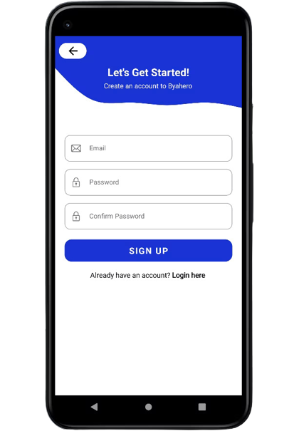
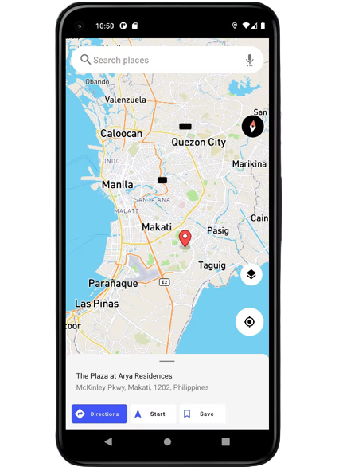
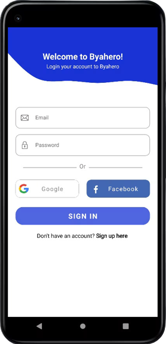
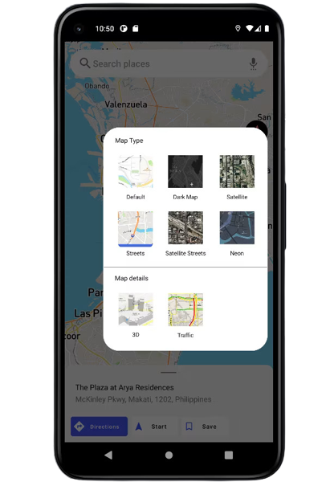
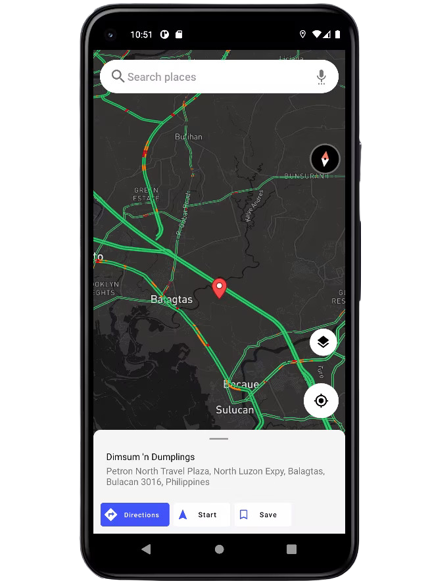
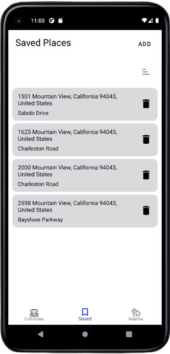

Google maps clone, with live weather updates.

    
    
  

    
    
  

      
    

  

 

# Libraries and APIs

The libraries I've used: 
- [Hilt](https://dagger.dev/hilt/)
- [Room](https://developer.android.com/jetpack/androidx/releases/room?hl=id)
- [Retrofit](https://square.github.io/retrofit/)
- [Coil](https://coil-kt.github.io/coil/getting_started/)
- [Android-Gif-Drawable](https://github.com/koral--/android-gif-drawable)
- [AestheticDialogs](https://github.com/gabriel-TheCode/AestheticDialogs)
- [FirebaseAuth](https://firebase.google.com/docs/auth)
- [FirebaseCrashlytics](https://firebase.google.com/docs/crashlytics/get-started?authuser=0&platform=android)
- [SimpleLocation](https://github.com/delight-im/Android-SimpleLocation)
- [Mapbox Maps Sdk](https://docs.mapbox.com/android/maps/guides/)
- [Mapbox Navigation Sdk](https://docs.mapbox.com/android/navigation/guides/)
- [EasyPermission](https://github.com/googlesamples/easypermissions)
